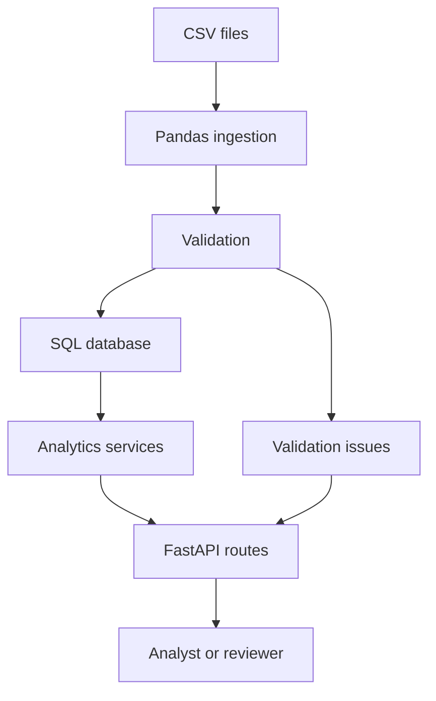

# Architecture

## Overview

The engine is built as a small internal-risk-platform style backend:

## Layers

- `app/api`: FastAPI app and route definitions.
- `app/services`: Database-backed orchestration for ingestion, validation, and reporting.
- `app/analytics`: Deterministic calculation functions.
- `app/db`: SQLAlchemy models, session management, and repositories.
- `app/schemas`: Pydantic API response models.
- `data`: Sample and intentionally bad CSV datasets.
- `tests`: Unit and integration tests.

## Calculation Choices

The MVP uses weighted average cost accounting:

- Buy trades increase quantity and cost basis.
- Sell trades realize PnL against average cost before the sale.
- Buy fees increase cost basis.
- Sell fees reduce realized PnL.
- Unrealized PnL marks remaining quantity against the latest price on or before the report date.

Short selling is disabled by default.

