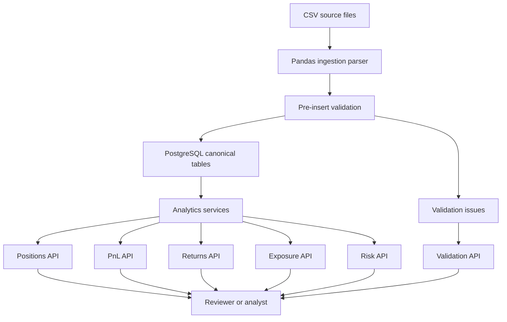
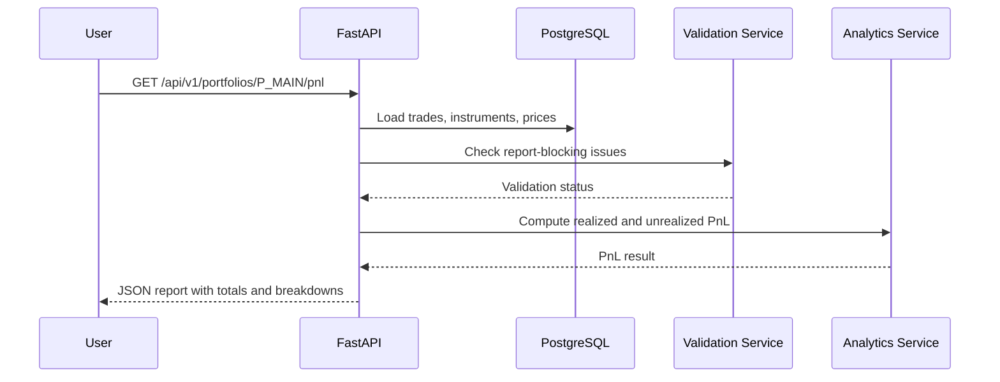

# Portfolio Risk & PnL Analytics Engine PRD

## 1. Executive Summary

### Product Name
Portfolio Risk & PnL Analytics Engine

### Canonical Repository
[jaivikjoshi/Portfolio-Risk-PnL-Analytics-Engine](https://github.com/jaivikjoshi/Portfolio-Risk-PnL-Analytics-Engine)

### One-Liner
A backend-first portfolio analytics platform that ingests raw trades and prices, validates financial data quality, computes positions, realized PnL, unrealized PnL, returns, exposures, and risk metrics, and exposes the results through FastAPI and PostgreSQL-backed reporting endpoints.

### Product Vision
Build a credible, production-style analytics engine that demonstrates software engineering, data engineering, financial modeling, API design, SQL, validation, testing, and observability. The project should feel like a small but serious internal risk platform used by portfolio managers, analysts, or operations teams to answer:

- What do we currently hold?
- How much money have we made or lost?
- Which assets, sectors, and currencies drive exposure?
- Are trades and market prices clean enough to trust?
- Where are portfolio risks concentrated?
- Can the system explain each number from raw input to final report?

### Resume Claim This Project Must Support
The finished project should substantiate the resume bullets:

- Created end-to-end portfolio reporting for positions, realized PnL, unrealized PnL, returns, and asset exposure by transforming raw trade and price data with Python, SQL, Pandas, and NumPy.
- Increased reporting reliability by validating missing prices, invalid trades, and inconsistent positions through PostgreSQL schemas and FastAPI endpoints.

This PRD treats those claims as acceptance requirements, not marketing copy.

## 2. Goals and Non-Goals

### Goals

1. Ingest raw portfolio data:
   - Trades
   - Prices
   - Instruments
   - Accounts or portfolios
   - Optional benchmark and FX rates

2. Validate financial data quality:
   - Missing prices
   - Duplicate trades
   - Invalid trade quantities
   - Invalid price values
   - Trades for unknown instruments
   - Position breaks
   - Out-of-order trade dates
   - Currency mismatches
   - Stale prices

3. Compute portfolio analytics:
   - Position quantity
   - Average cost
   - Cost basis
   - Market value
   - Realized PnL
   - Unrealized PnL
   - Total PnL
   - Daily returns
   - Cumulative returns
   - Asset exposure
   - Sector exposure
   - Currency exposure
   - Portfolio volatility
   - Sharpe ratio
   - Max drawdown
   - Value at Risk, basic historical VaR

4. Provide API endpoints:
   - Upload or seed datasets
   - Validate data
   - Query positions
   - Query PnL
   - Query exposures
   - Query returns
   - Query risk metrics
   - Query validation issues

5. Store canonical data in PostgreSQL:
   - Enforce schemas and constraints
   - Track ingestion batches
   - Store validation errors
   - Support reproducible analytics runs

6. Create a polished developer experience:
   - Local Docker Compose setup
   - Seed data
   - README
   - OpenAPI docs
   - Tests
   - CI-ready commands
   - Example notebooks or scripts

7. Build in phases so the project can be completed incrementally while still looking coherent at each milestone.

### Non-Goals

1. Real brokerage integration.
2. Live trading or order execution.
3. Real-time tick processing.
4. Advanced derivatives pricing.
5. Regulatory reporting.
6. Production authentication beyond optional API key or local-only auth.
7. A complex frontend dashboard in the first release.

These can be future extensions, but the core project should stay focused on reliable portfolio analytics.

## 3. Target Users

### Primary User: Portfolio Analyst
Needs clean daily reports showing positions, PnL, returns, exposures, and risk summaries. Cares about correctness, traceability, and fast answers.

### Secondary User: Data Engineer
Needs ingestion logs, validation failures, reproducible transformations, database constraints, and clean APIs for downstream use.

### Tertiary User: Hiring Manager or Technical Reviewer
Needs to see evidence of practical backend engineering, financial domain thinking, test coverage, and clear documentation.

## 4. User Stories

### Data Ingestion

- As an analyst, I can upload or seed trades so that the system can calculate portfolio state.
- As an analyst, I can upload or seed daily closing prices so that market values and unrealized PnL can be computed.
- As a data engineer, I can inspect ingestion batches so that I know which files were loaded and whether they passed validation.

### Data Validation

- As an analyst, I can run validation checks before trusting a report.
- As a data engineer, I can see row-level validation errors with severity, source file, source row, rule name, and explanation.
- As a reviewer, I can intentionally run bad sample data and see the engine catch missing prices, invalid trades, and inconsistent positions.

### Portfolio Reporting

- As an analyst, I can retrieve current positions by portfolio and date.
- As an analyst, I can retrieve realized and unrealized PnL by portfolio, instrument, and date range.
- As an analyst, I can retrieve returns and cumulative performance over time.
- As an analyst, I can retrieve exposure by asset class, sector, currency, and instrument.

### Risk Analytics

- As an analyst, I can retrieve volatility, Sharpe ratio, max drawdown, and historical VaR.
- As an analyst, I can identify top PnL contributors and largest exposure concentrations.

### Explainability

- As a reviewer, I can trace a final PnL number back to trades, prices, and calculation rules.
- As a developer, I can run tests that prove the calculations work on deterministic sample portfolios.

## 5. Scope by Release

### MVP: Reliable End-to-End Analytics

The MVP must support the resume claim end to end.

Required:

- Python project scaffold
- FastAPI service
- PostgreSQL database
- SQLAlchemy or SQLModel models
- Alembic migrations
- Docker Compose for API and database
- CSV ingestion for trades, instruments, prices, and portfolios
- Pandas and NumPy transformation layer
- Validation framework
- Position calculation
- Realized PnL calculation
- Unrealized PnL calculation
- Returns calculation
- Exposure calculation
- API endpoints for reporting and validation issues
- Unit tests for financial calculations
- Integration tests for API endpoints
- Seed data and intentionally bad data samples
- README with local run instructions

### V1: Risk and Reliability Layer

Required:

- Volatility
- Sharpe ratio
- Sortino ratio
- Max drawdown
- Historical VaR
- Top contributors
- Concentration analysis
- Ingestion batch audit table
- Idempotent ingestion by source file hash
- More robust validation severities
- API pagination and filtering
- More test coverage around edge cases

### V2: Analyst Experience

Recommended:

- Lightweight dashboard using Streamlit, React, or a static report generator
- Export reports to CSV
- Export daily summary to JSON
- Portfolio comparison endpoint
- Benchmark return comparison
- FX conversion for multi-currency portfolios
- CLI commands for ingestion and report generation

### V3: Production Polish

Recommended:

- CI pipeline
- API key auth
- Structured logging
- Metrics endpoint
- Background job runner for scheduled analytics
- Container health checks
- Cloud deployment option
- Database indexes and query performance notes

## 6. Functional Requirements

### 6.1 Data Sources

The engine should support CSV ingestion first. This keeps the project reproducible and reviewer-friendly.

#### Portfolios CSV

Required columns:

- portfolio_id
- portfolio_name
- base_currency
- created_at

Example:

```csv
portfolio_id,portfolio_name,base_currency,created_at
P_MAIN,Main Long Only Portfolio,USD,2026-01-01
```

#### Instruments CSV

Required columns:

- instrument_id
- ticker
- name
- asset_class
- sector
- currency
- exchange

Example:

```csv
instrument_id,ticker,name,asset_class,sector,currency,exchange
I_AAPL,AAPL,Apple Inc.,Equity,Technology,USD,NASDAQ
```

#### Trades CSV

Required columns:

- trade_id
- portfolio_id
- instrument_id
- trade_date
- side
- quantity
- price
- fees
- currency

Example:

```csv
trade_id,portfolio_id,instrument_id,trade_date,side,quantity,price,fees,currency
T_001,P_MAIN,I_AAPL,2026-01-02,BUY,100,185.50,1.00,USD
```

#### Prices CSV

Required columns:

- instrument_id
- price_date
- close_price
- currency

Example:

```csv
instrument_id,price_date,close_price,currency
I_AAPL,2026-01-03,187.20,USD
```

#### Optional FX Rates CSV

Required columns:

- rate_date
- from_currency
- to_currency
- rate

Example:

```csv
rate_date,from_currency,to_currency,rate
2026-01-03,CAD,USD,0.7350
```

### 6.2 Ingestion Requirements

The system must:

- Accept local CSV files through CLI scripts and API upload endpoints.
- Assign each ingestion request a batch ID.
- Store raw row count, accepted row count, rejected row count, timestamp, and source file hash.
- Reject duplicate files unless forced.
- Store row-level validation issues.
- Load valid records into normalized PostgreSQL tables.
- Support a seed command for demo data.

### 6.3 Validation Requirements

Validation should run in two layers:

1. Database constraints:
   - Required fields
   - Unique IDs
   - Foreign keys
   - Positive quantities
   - Non-negative fees
   - Positive prices
   - Valid enum values

2. Application validation:
   - Missing price for held instrument on report date
   - Trade references unknown portfolio
   - Trade references unknown instrument
   - Sell quantity exceeds held quantity, unless shorting is explicitly enabled
   - Duplicate trade ID
   - Price currency differs from instrument currency
   - Trade currency differs from instrument currency without FX rate
   - Stale price beyond configured threshold
   - Position reconciliation mismatch

Validation issue fields:

- issue_id
- batch_id
- severity
- entity_type
- entity_id
- rule_code
- message
- source_file
- source_row
- created_at

Severity levels:

- INFO: Useful context, report can run.
- WARNING: Possible issue, report can run with caution.
- ERROR: Data issue, affected records excluded or report section incomplete.
- CRITICAL: Report should fail.

### 6.4 Position Calculation

The system must compute positions as of a report date.

For each portfolio and instrument:

- Sum buys as positive quantity.
- Sum sells as negative quantity.
- Current quantity = buys - sells.
- Position is open if current quantity is non-zero.
- Market value = current quantity * latest valid close price on or before report date.
- Cost basis should be computed using weighted average cost for MVP.

MVP cost basis method:

- BUY increases quantity and cost basis.
- SELL reduces quantity and realizes PnL against average cost.
- Average cost = current cost basis / current quantity.
- Fees are included in cost basis for buys and deducted from realized PnL for sells.

Future extension:

- FIFO and LIFO tax lot accounting.

### 6.5 Realized PnL Calculation

For a SELL trade:

```text
realized_pnl = (sell_price - average_cost_before_sell) * sell_quantity - sell_fees
```

For short positions in the future:

```text
realized_pnl = (average_short_sale_price - buy_to_cover_price) * covered_quantity - fees
```

MVP should disable shorting unless explicitly configured.

### 6.6 Unrealized PnL Calculation

For each open position:

```text
unrealized_pnl = (market_price - average_cost) * current_quantity
```

Total PnL:

```text
total_pnl = realized_pnl + unrealized_pnl
```

### 6.7 Returns Calculation

MVP daily return:

```text
daily_return = (portfolio_market_value_today - portfolio_market_value_yesterday - net_cash_flow_today) / portfolio_market_value_yesterday
```

For simplified MVP, if no external deposits or withdrawals exist:

```text
daily_return = (portfolio_market_value_today - portfolio_market_value_yesterday) / portfolio_market_value_yesterday
```

Required outputs:

- daily_return
- cumulative_return
- rolling_7d_return
- rolling_30d_return, if enough data exists

### 6.8 Exposure Calculation

Exposure dimensions:

- Instrument
- Ticker
- Asset class
- Sector
- Currency
- Portfolio

Required metrics:

- market_value
- gross_exposure
- net_exposure
- exposure_percentage

Formula:

```text
exposure_percentage = instrument_market_value / total_portfolio_market_value
```

### 6.9 Risk Metrics

MVP or V1 risk metrics:

- Volatility:

```text
annualized_volatility = std(daily_returns) * sqrt(252)
```

- Sharpe ratio:

```text
sharpe_ratio = (annualized_return - risk_free_rate) / annualized_volatility
```

- Sortino ratio:

```text
sortino_ratio = (annualized_return - risk_free_rate) / downside_deviation
```

- Max drawdown:

```text
drawdown = portfolio_value / running_peak - 1
max_drawdown = min(drawdown)
```

- Historical VaR:

```text
var_95 = percentile(daily_returns, 5) * portfolio_value
```

## 7. API Requirements

### API Style

- Framework: FastAPI
- Serialization: Pydantic
- Database access: SQLAlchemy or SQLModel
- API docs: OpenAPI at `/docs`
- Version prefix: `/api/v1`

### Core Endpoints

#### Health

```http
GET /health
```

Response:

```json
{
  "status": "ok",
  "service": "portfolio-risk-pnl-analytics-engine"
}
```

#### Ingest Data

```http
POST /api/v1/ingestion/trades
POST /api/v1/ingestion/prices
POST /api/v1/ingestion/instruments
POST /api/v1/ingestion/portfolios
```

Response:

```json
{
  "batch_id": "BATCH_20260630_001",
  "status": "completed",
  "rows_received": 1000,
  "rows_loaded": 992,
  "issues_count": 8
}
```

#### Validate Data

```http
POST /api/v1/validation/run
GET /api/v1/validation/issues
GET /api/v1/validation/issues/{issue_id}
```

Filters:

- batch_id
- severity
- entity_type
- portfolio_id
- start_date
- end_date

#### Positions

```http
GET /api/v1/portfolios/{portfolio_id}/positions?as_of=2026-01-31
```

Response:

```json
{
  "portfolio_id": "P_MAIN",
  "as_of": "2026-01-31",
  "positions": [
    {
      "instrument_id": "I_AAPL",
      "ticker": "AAPL",
      "quantity": 100,
      "average_cost": 185.51,
      "market_price": 191.25,
      "market_value": 19125.00,
      "unrealized_pnl": 574.00
    }
  ]
}
```

#### PnL

```http
GET /api/v1/portfolios/{portfolio_id}/pnl?start_date=2026-01-01&end_date=2026-01-31
```

Response:

```json
{
  "portfolio_id": "P_MAIN",
  "start_date": "2026-01-01",
  "end_date": "2026-01-31",
  "realized_pnl": 1200.50,
  "unrealized_pnl": 4300.25,
  "total_pnl": 5500.75,
  "by_instrument": []
}
```

#### Returns

```http
GET /api/v1/portfolios/{portfolio_id}/returns?start_date=2026-01-01&end_date=2026-01-31
```

#### Exposures

```http
GET /api/v1/portfolios/{portfolio_id}/exposures?as_of=2026-01-31&group_by=sector
```

Supported `group_by` values:

- instrument
- asset_class
- sector
- currency

#### Risk

```http
GET /api/v1/portfolios/{portfolio_id}/risk?start_date=2026-01-01&end_date=2026-01-31
```

Response:

```json
{
  "portfolio_id": "P_MAIN",
  "annualized_volatility": 0.182,
  "sharpe_ratio": 1.14,
  "sortino_ratio": 1.62,
  "max_drawdown": -0.084,
  "var_95": -2450.25
}
```

## 8. Data Model

## 8A. Architecture Overview

### System Components

- FastAPI application: serves ingestion, validation, analytics, and reporting endpoints.
- PostgreSQL database: stores canonical portfolio data, validation issues, and analytics audit records.
- Pandas ingestion layer: reads CSVs, normalizes types, applies pre-insert validation, and prepares records.
- Analytics engine: computes positions, PnL, returns, exposure, and risk metrics.
- Validation engine: runs deterministic rule checks and stores issues.
- Test suite: proves financial calculations and API behavior against deterministic datasets.
- Documentation layer: README, OpenAPI docs, calculation methodology, and sample outputs.

### Data Flow



### Request Flow for a Report



### Design Principles

- Deterministic first: the same inputs must always produce the same outputs.
- Explainable calculations: important figures should be traceable to trades, prices, and formulas.
- Database-enforced integrity: use PostgreSQL constraints for basic truth, then application validation for domain rules.
- Small vertical slices: each phase should produce working software, not just partial infrastructure.
- Reviewer-friendly setup: the project should run locally without paid services or private data.

## 8B. Implementation Backlog

### Epic 1: Project Foundation

Stories:

- Create Python package structure.
- Add FastAPI app entry point.
- Add health endpoint.
- Add Dockerfile.
- Add Docker Compose with PostgreSQL.
- Add test runner and first smoke test.
- Add Ruff configuration.

Acceptance:

- `docker compose up --build` starts the API and database.
- `GET /health` returns status `ok`.
- `pytest` runs successfully.

### Epic 2: Database Layer

Stories:

- Add SQLAlchemy or SQLModel models.
- Add Alembic migrations.
- Add database session dependency.
- Add repository functions for portfolios, instruments, trades, prices, batches, and validation issues.

Acceptance:

- Fresh database can be migrated from zero.
- Foreign keys and uniqueness constraints are enforced.
- Tests can create and clean up records.

### Epic 3: CSV Ingestion

Stories:

- Create sample CSV files.
- Create intentionally bad CSV files.
- Implement CSV parsing with Pandas.
- Normalize date, decimal, enum, and ID fields.
- Track ingestion batches.
- Detect duplicate source files by hash.
- Add ingestion endpoints.
- Add seed script.

Acceptance:

- Valid sample data loads fully.
- Bad sample data records validation issues.
- Duplicate ingestion is blocked unless forced.

### Epic 4: Validation

Stories:

- Implement validation rule registry.
- Implement missing price checks.
- Implement invalid trade checks.
- Implement duplicate trade checks.
- Implement unknown instrument and unknown portfolio checks.
- Implement sell quantity exceeds holdings check.
- Implement validation issue API.

Acceptance:

- Each bad sample triggers the expected rule code.
- Validation issues include severity, rule code, entity ID, and message.
- Critical issues can block report generation.

### Epic 5: Portfolio Calculations

Stories:

- Implement weighted average cost position engine.
- Implement realized PnL.
- Implement unrealized PnL.
- Implement daily market value.
- Implement daily and cumulative returns.
- Implement exposure grouping.

Acceptance:

- Golden dataset tests pass exactly.
- Endpoints return values matching hand-calculated examples.
- Exposure percentages reconcile to portfolio market value.

### Epic 6: Risk Metrics

Stories:

- Implement volatility.
- Implement Sharpe ratio.
- Implement Sortino ratio.
- Implement max drawdown.
- Implement historical VaR.
- Add risk endpoint.

Acceptance:

- Known return series produce expected risk metrics.
- API returns clear null or insufficient-data responses when the date range is too short.

### Epic 7: Documentation and Demo

Stories:

- Write README.
- Add architecture doc.
- Add calculation methodology doc.
- Add API examples.
- Add sample response JSON.
- Add demo flow from seed data to final reports.

Acceptance:

- A reviewer can run the project and query all MVP endpoints in under 10 minutes.
- README proves the resume bullets with concrete commands and outputs.

## 8C. Local Developer Workflow

Recommended commands once implementation begins:

```bash
python -m venv .venv
source .venv/bin/activate
pip install -e ".[dev]"
docker compose up -d db
alembic upgrade head
python scripts/seed_db.py
uvicorn app.api.main:app --reload
pytest
```

Recommended API demo flow:

```bash
curl http://localhost:8000/health
curl "http://localhost:8000/api/v1/portfolios/P_MAIN/positions?as_of=2026-01-31"
curl "http://localhost:8000/api/v1/portfolios/P_MAIN/pnl?start_date=2026-01-01&end_date=2026-01-31"
curl "http://localhost:8000/api/v1/portfolios/P_MAIN/exposures?as_of=2026-01-31&group_by=sector"
curl "http://localhost:8000/api/v1/portfolios/P_MAIN/risk?start_date=2026-01-01&end_date=2026-01-31"
curl "http://localhost:8000/api/v1/validation/issues"
```

## 8D. Main Risks and Mitigations

| Risk | Impact | Mitigation |
| --- | --- | --- |
| PnL math is ambiguous | Reviewer may question correctness | Document weighted average cost method and test golden dataset |
| Project becomes too broad | MVP may not finish | Build vertical slices and defer dashboard, FX, and advanced derivatives |
| Data validation becomes messy | Hard to explain and test | Use rule codes, severities, and deterministic bad samples |
| PostgreSQL setup slows development | Friction for local demo | Use Docker Compose and seed script |
| Performance issues with repeated calculations | Slow reports | Add indexes, date filters, and optional persisted snapshots |
| Resume claim feels unsupported | Career signal weakens | Maintain traceability table and sample outputs |

## 8E. Milestone Timeline

An aggressive but realistic build schedule:

| Day | Focus | End State |
| --- | --- | --- |
| 1 | Project foundation | FastAPI, Docker, PostgreSQL, tests running |
| 2 | Database models | Migrations and core schemas complete |
| 3 | Ingestion | Sample CSVs load into database |
| 4 | Validation | Bad data produces structured issues |
| 5 | Positions | Position endpoint works against seed data |
| 6 | PnL | Realized and unrealized PnL works |
| 7 | Returns and exposure | Performance and concentration endpoints work |
| 8 | Risk metrics | Volatility, Sharpe, drawdown, VaR implemented |
| 9 | Tests and edge cases | Golden dataset and API tests pass |
| 10 | Documentation polish | README, examples, and project narrative complete |

### Tables

#### portfolios

- id
- portfolio_id
- name
- base_currency
- created_at
- updated_at

Constraints:

- portfolio_id unique
- base_currency not null

#### instruments

- id
- instrument_id
- ticker
- name
- asset_class
- sector
- currency
- exchange
- created_at
- updated_at

Constraints:

- instrument_id unique
- ticker not null
- asset_class enum
- currency not null

#### trades

- id
- trade_id
- portfolio_id
- instrument_id
- trade_date
- side
- quantity
- price
- fees
- currency
- batch_id
- created_at
- updated_at

Constraints:

- trade_id unique
- portfolio_id foreign key
- instrument_id foreign key
- side in BUY, SELL
- quantity > 0
- price > 0
- fees >= 0

#### prices

- id
- instrument_id
- price_date
- close_price
- currency
- batch_id
- created_at
- updated_at

Constraints:

- unique instrument_id plus price_date
- close_price > 0
- instrument_id foreign key

#### ingestion_batches

- id
- batch_id
- source_type
- source_file
- source_hash
- status
- rows_received
- rows_loaded
- rows_rejected
- started_at
- completed_at

Constraints:

- batch_id unique
- source_hash unique unless force reload is used

#### validation_issues

- id
- issue_id
- batch_id
- severity
- entity_type
- entity_id
- rule_code
- message
- source_file
- source_row
- created_at

#### analytics_runs

- id
- run_id
- portfolio_id
- run_type
- start_date
- end_date
- as_of_date
- status
- created_at
- completed_at

Optional V1 tables:

- portfolio_daily_values
- portfolio_daily_returns
- position_snapshots
- pnl_snapshots
- fx_rates

## 9. Suggested Repository Structure

```text
portfolio-risk-pnl-analytics-engine/
  app/
    api/
      routes/
        health.py
        ingestion.py
        validation.py
        positions.py
        pnl.py
        returns.py
        exposures.py
        risk.py
      dependencies.py
      main.py
    core/
      config.py
      logging.py
      exceptions.py
    db/
      base.py
      session.py
      models.py
      repositories.py
    schemas/
      ingestion.py
      validation.py
      positions.py
      pnl.py
      returns.py
      exposures.py
      risk.py
    services/
      ingestion_service.py
      validation_service.py
      position_service.py
      pnl_service.py
      return_service.py
      exposure_service.py
      risk_service.py
    analytics/
      positions.py
      pnl.py
      returns.py
      exposures.py
      risk.py
    utils/
      dates.py
      hashing.py
      money.py
  alembic/
    versions/
  data/
    sample/
      portfolios.csv
      instruments.csv
      trades.csv
      prices.csv
    bad_samples/
      missing_prices.csv
      invalid_trades.csv
      inconsistent_positions.csv
  docs/
    PRD.md
    ARCHITECTURE.md
    API_EXAMPLES.md
  notebooks/
    analytics_walkthrough.ipynb
  tests/
    unit/
      test_positions.py
      test_pnl.py
      test_returns.py
      test_exposures.py
      test_risk.py
      test_validation.py
    integration/
      test_ingestion_api.py
      test_reporting_api.py
  scripts/
    seed_db.py
    run_validation.py
    generate_report.py
  .env.example
  .gitignore
  docker-compose.yml
  Dockerfile
  pyproject.toml
  README.md
```

## 10. Technical Stack

### Backend

- Python 3.11 or newer
- FastAPI
- Pydantic
- SQLAlchemy or SQLModel
- Alembic
- Uvicorn

### Data and Analytics

- PostgreSQL
- Pandas
- NumPy

### Testing

- Pytest
- HTTPX or FastAPI TestClient
- pytest-cov
- factory_boy or hand-built fixtures

### Developer Tooling

- Docker
- Docker Compose
- Ruff
- MyPy, optional but recommended
- Pre-commit, optional

### Documentation

- README
- OpenAPI docs
- Example curl commands
- Architecture diagram
- Calculation methodology document

## 11. Calculation Edge Cases

The project should explicitly test these:

- Buy only, no sells.
- Buy then partial sell.
- Buy then full sell.
- Multiple buys at different prices.
- Sell more than held, rejected when shorting disabled.
- Missing price on report date, use latest previous price if allowed.
- No price on or before report date, validation error.
- Duplicate trade ID.
- Price equal to zero, rejected.
- Negative quantity, rejected.
- Fee greater than trade notional, warning or error depending rule.
- Portfolio with no positions.
- Instrument with trades but no instrument master record.
- Return calculation when previous market value is zero.
- Sector exposure when sector is missing.
- Multi-currency trade without FX rate, error in V2 if FX enabled.

## 12. Acceptance Criteria

### MVP Acceptance Criteria

The MVP is complete when:

1. A developer can run:

```bash
docker compose up --build
```

2. The API starts successfully and serves:

```http
GET /health
GET /docs
```

3. A seed script loads sample portfolios, instruments, trades, and prices.

4. Validation identifies:

   - Missing prices
   - Invalid trades
   - Duplicate trades
   - Sell quantity greater than current holdings
   - Trades for unknown instruments

5. The positions endpoint returns correct quantities, average cost, market value, and unrealized PnL.

6. The PnL endpoint returns correct realized, unrealized, and total PnL.

7. The returns endpoint returns daily and cumulative returns.

8. The exposure endpoint returns exposure by instrument, asset class, sector, and currency.

9. Unit tests cover core calculations with deterministic inputs.

10. Integration tests cover ingestion and reporting endpoints.

11. README documents the project, setup, API examples, and calculation methodology.

12. The project contains enough sample output for a reviewer to verify the resume bullets quickly.

### Resume Traceability Criteria

Each resume phrase maps to a concrete artifact:

| Resume Phrase | Project Evidence |
| --- | --- |
| End-to-end portfolio reporting | README demo flow, seed data, API endpoints |
| Positions | `/positions` endpoint, `position_service.py`, tests |
| Realized PnL | `/pnl` endpoint, realized PnL tests |
| Unrealized PnL | `/pnl` endpoint, position valuation tests |
| Returns | `/returns` endpoint, daily return tests |
| Asset exposure | `/exposures` endpoint, exposure tests |
| Python, SQL, Pandas, NumPy | Analytics modules, SQLAlchemy models, transformations |
| PostgreSQL schemas | Alembic migrations and constraints |
| FastAPI endpoints | `/api/v1` routes and OpenAPI docs |
| Missing prices validation | Validation rules and bad sample dataset |
| Invalid trades validation | Validation rules and bad sample dataset |
| Inconsistent positions validation | Validation rules and tests |

## 13. Implementation Roadmap

### Phase 0: Project Foundation

Tasks:

- Create Python project with `pyproject.toml`.
- Add FastAPI app scaffold.
- Add Dockerfile and Docker Compose.
- Add PostgreSQL service.
- Add `.env.example`.
- Add README skeleton.
- Add health endpoint.
- Add test framework.

Deliverable:

- Local API runs and health check passes.

### Phase 1: Database and Models

Tasks:

- Define database models for portfolios, instruments, trades, prices, ingestion batches, and validation issues.
- Configure SQLAlchemy session.
- Set up Alembic.
- Create first migration.
- Add repository helpers.

Deliverable:

- Database schema can be created from migrations.

### Phase 2: Sample Data and Ingestion

Tasks:

- Create sample CSVs.
- Create bad sample CSVs.
- Implement file hashing.
- Implement ingestion batch tracking.
- Implement CSV parsing using Pandas.
- Implement basic API upload endpoints.
- Implement seed script.

Deliverable:

- Valid sample data loads into PostgreSQL with batch audit records.

### Phase 3: Validation Framework

Tasks:

- Define validation rule interface.
- Implement schema-level validation before insert.
- Implement cross-table validation after insert.
- Store validation issues.
- Add validation API endpoints.
- Add tests for each rule.

Deliverable:

- Bad sample data produces clear validation issues.

### Phase 4: Position Engine

Tasks:

- Implement weighted average cost logic.
- Implement position quantity calculation.
- Implement latest available price lookup.
- Implement market value calculation.
- Implement unrealized PnL.
- Add position endpoint.
- Add unit and integration tests.

Deliverable:

- Positions endpoint returns correct open positions as of a date.

### Phase 5: PnL Engine

Tasks:

- Implement realized PnL for sells.
- Track fees correctly.
- Aggregate PnL by portfolio, instrument, and date range.
- Add PnL endpoint.
- Add deterministic test cases.

Deliverable:

- PnL endpoint explains realized, unrealized, and total PnL.

### Phase 6: Returns and Exposure

Tasks:

- Implement daily portfolio value series.
- Implement daily returns and cumulative returns.
- Implement exposure grouping.
- Add returns endpoint.
- Add exposure endpoint.
- Add tests.

Deliverable:

- API returns performance and concentration analytics.

### Phase 7: Risk Metrics

Tasks:

- Implement volatility.
- Implement Sharpe ratio.
- Implement Sortino ratio.
- Implement max drawdown.
- Implement historical VaR.
- Add risk endpoint.
- Add tests for known time series.

Deliverable:

- API returns basic portfolio risk analytics.

### Phase 8: Documentation and Polish

Tasks:

- Write README with setup, demo, and API examples.
- Add calculation methodology docs.
- Add architecture diagram.
- Add sample curl commands.
- Add screenshots or sample JSON output.
- Add lint and test commands.
- Add CI workflow, optional.

Deliverable:

- Project is GitHub-ready and resume-ready.

## 14. Testing Strategy

### Unit Tests

Cover:

- Position quantity math
- Weighted average cost
- Realized PnL
- Unrealized PnL
- Daily returns
- Cumulative returns
- Exposures
- Volatility
- Sharpe ratio
- Max drawdown
- VaR
- Validation rules

### Integration Tests

Cover:

- Health endpoint
- Ingestion endpoint
- Validation endpoint
- Positions endpoint
- PnL endpoint
- Returns endpoint
- Exposures endpoint
- Risk endpoint

### Golden Dataset Tests

Create a small deterministic portfolio with expected results calculated by hand.

Example:

- Buy 100 shares at 10.00 with 1.00 fee.
- Buy 50 shares at 12.00 with 1.00 fee.
- Sell 80 shares at 15.00 with 1.00 fee.
- Mark remaining shares at 14.00.

Expected:

- Initial cost basis includes buy fees.
- Average cost before sell is deterministic.
- Realized PnL is deterministic.
- Remaining quantity is 70.
- Unrealized PnL is deterministic.

This dataset should be used in tests and documentation.

## 15. Observability and Reliability

### Logs

Log:

- App startup
- Database connection success or failure
- Ingestion start and completion
- Validation run start and completion
- Report generation errors
- Critical validation failures

### Error Handling

Use structured errors:

```json
{
  "error_code": "MISSING_PRICE",
  "message": "No price found for instrument I_AAPL on or before 2026-01-31.",
  "details": {
    "instrument_id": "I_AAPL",
    "as_of": "2026-01-31"
  }
}
```

### Reliability Requirements

- Ingestion should be idempotent by source hash.
- Reports should fail clearly if critical data is missing.
- Validation issues should be queryable after failures.
- Calculations should be deterministic for the same input data.

## 16. Security and Privacy

MVP:

- No real user data.
- Sample data only.
- Local development only.
- Environment variables for database credentials.

V1:

- Optional API key for ingestion and reports.
- Request size limits.
- File type checks for uploads.
- Avoid logging entire uploaded files.

## 17. Performance Requirements

MVP target:

- Handle 10,000 trades.
- Handle 1,000 instruments.
- Handle 2 years of daily prices.
- Generate a portfolio report in under 3 seconds locally.

V1 target:

- Handle 100,000 trades.
- Add indexes for portfolio ID, instrument ID, trade date, and price date.
- Cache or persist daily portfolio values.

Recommended indexes:

- trades(portfolio_id, trade_date)
- trades(instrument_id, trade_date)
- prices(instrument_id, price_date)
- validation_issues(batch_id, severity)
- ingestion_batches(source_hash)

## 18. Future Enhancements

- FIFO and LIFO tax lot accounting.
- Short selling support.
- Options and fixed income analytics.
- Benchmark comparison.
- FX conversion.
- Scenario analysis.
- Stress testing.
- Monte Carlo simulation.
- Streamlit or React dashboard.
- Scheduled daily report generation.
- Export to CSV, Excel, and PDF.
- Cloud deployment with managed PostgreSQL.
- LLM-generated natural language portfolio summaries.

## 19. Project Success Metrics

### Engineering Metrics

- 80 percent or higher test coverage for analytics modules.
- All MVP endpoints documented in OpenAPI.
- All sample data loads from a single command.
- All golden dataset calculations pass.
- README demo can be completed in under 10 minutes.

### Portfolio Analytics Metrics

- Positions match expected quantities.
- PnL reconciles to trade and price data.
- Exposure percentages sum to approximately 100 percent for long-only portfolios.
- Validation catches intentionally bad data.

### Career Signal Metrics

- A reviewer can understand the project in 60 seconds from README.
- A reviewer can run the demo in under 10 minutes.
- Resume bullets can be verified from code, tests, docs, and sample outputs.
- GitHub repository shows backend, database, analytics, validation, and testing depth.

## 20. Recommended Build Order

The fastest credible path:

1. Foundation: FastAPI, PostgreSQL, Docker, tests.
2. Data model: portfolios, instruments, trades, prices.
3. Ingestion: seed data and CSV upload.
4. Validation: missing prices, invalid trades, inconsistent positions.
5. Positions: quantity, average cost, market value.
6. PnL: realized, unrealized, total.
7. Returns and exposure.
8. Risk metrics.
9. Documentation and sample outputs.
10. Optional dashboard or exports.

## 21. Definition of Done

The project is truly done when:

- The repo can be cloned and run from scratch.
- The API, database, ingestion, validation, and analytics all work together.
- Tests prove the financial calculations.
- Bad data produces useful validation output.
- Documentation explains both how to run the project and how the math works.
- The implementation directly supports the resume claims.
- The project has enough polish that it can be discussed confidently in an interview.
